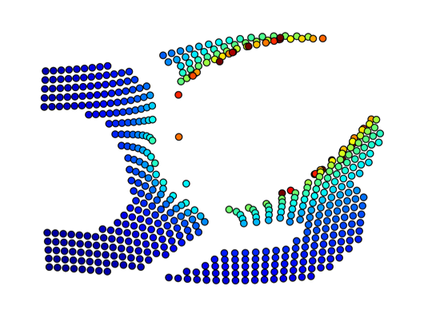

# d3-logo-fun

An exercise to get used to [D3](http://d3js.org/) and its [force layout](https://github.com/mbostock/d3/wiki/Force-Layout). 

Check out the [live version](http://timmysiauw.github.io/d3-logo-fun/).